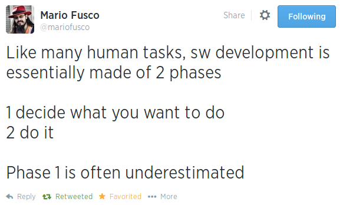
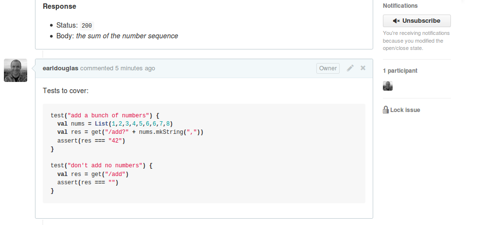
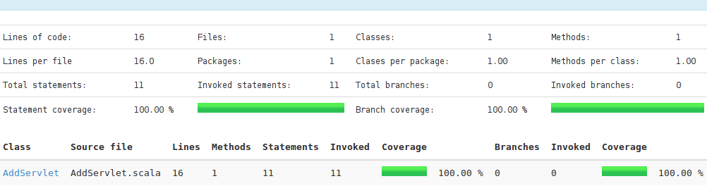
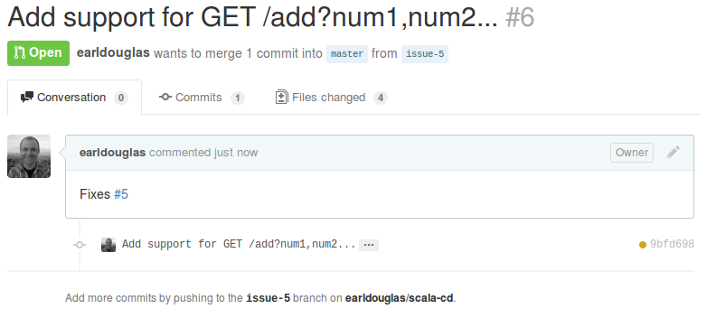
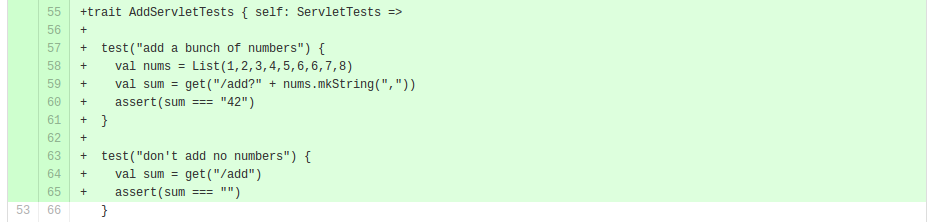
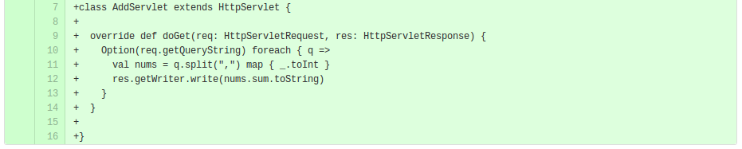
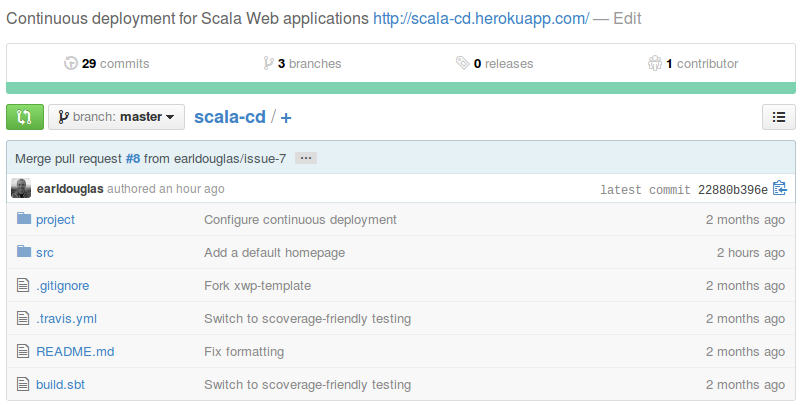
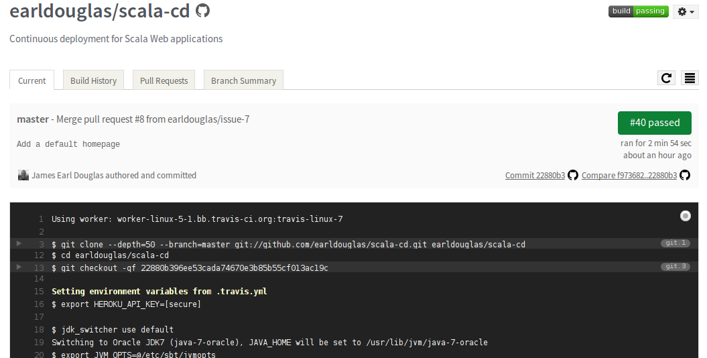
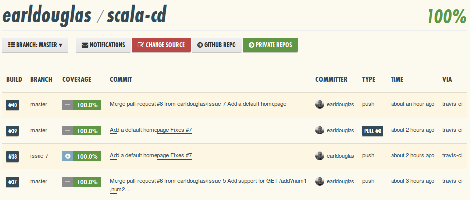
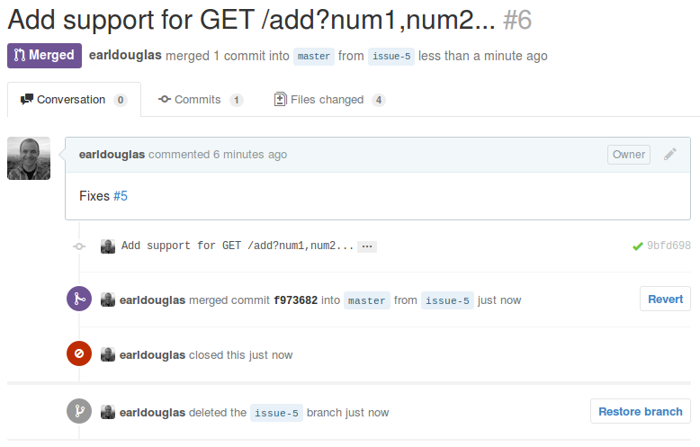

% Scala DevOps: <br />collaborative development and <br />continuous deployment
% James Earl Douglas<br />[&#64;jearldouglas](https://twitter.com/jearldouglas)
% August 8, 2014<br />[Scala by the Bay](http://www.scalabythebay.org/)

# A philosophy of DevOps

> How long would it take your organization to deploy a change that involves just one single line of code?

> Do you deploy changes at this pace on a repeatable, reliable basis?

*- Poppendieck*


# Abstract

In this talk, we look at how a Scala development team can work collaboratively to build, test, and deploy their software.

# Battle-tested, real-world certified

This approach has been successful in the development of multiple open source projects.

* [xsbt-web-plugin](https://github.com/earldouglas/xsbt-web-plugin/) - an sbt plugin for building Scala Web applications
* [Scalave](https://github.com/earldouglas/scalave/) - embeddable online Scala evaluation
* *Several others*

# Defining DevOps


# Defining DevOps :: so <strike>Zen</strike> Venn

<div class="figure">

</div>

# Defining DevOps :: software engineering

```basic
10 GOTO 10
```

<p>&nbsp;</p>


# Defining DevOps :: IT operations

*Keep sh&#42;t running.*

<p>&nbsp;</p>


# Defining DevOps :: quality assurance

*Ensure stakeholder happiness.*

<p>&nbsp;</p>


# DevOps lifecycle

* Test-driven development
* Collaborative development
* Continuous integration
* Continuous deployment

# Test-driven development

<p>&nbsp;</p>



# Test-driven development :: phases

* Specification
* Testing
* Implementation
* Coverage

# Test-driven development :: specification


# Test-driven development :: specification



# Test-driven development :: testing

*New development; new branch.*

```
$ git checkout -b issue-5
```

# Test-driven development :: testing

*Fully specify the desired feature, including how to use it.*

```scala
test("add a bunch of numbers") {
  val nums = List(1,2,3,4,5,6,6,7,8)
  val sum = get("/add?" + nums.mkString(","))
  assert(sum === "42")
}

test("don't add no numbers") {
  val sum = get("/add")
  assert(sum === "")
}
```

# Test-driven development :: failing test

*Make something break before fixing it.*

```
$ sbt test
...
[info] - add a bunch of numbers *** FAILED ***
[info] - don't add no numbers *** FAILED ***
...
[error] Failed: Total 2, Failed 2, Errors 0, Passed 0
```

# Test-driven development :: implementation

We'll use a Servlet with sbt and xsbt-web-plugin.

# Test-driven development :: implementation

*Let's make the test pass.*

```scala
class AddServlet extends HttpServlet {
  override def doGet(req: HttpServletRequest, res: HttpServletResponse) {
    Option(req.getQueryString) foreach { q =>
      val nums = q.split(",") map { _.toInt }
      res.getWriter.write(nums.sum.toString)
    }
  }
}
```

# Test-driven development :: passing test

*Bingo.*

```
$ sbt test
...
[info] - add a bunch of numbers
[info] - don't add no numbers
...
[info] Passed: Total 2, Failed 0, Errors 0, Passed 2
```

# Test-driven development :: coverage

*It's not pretty (yet), but we'll get there.*

```
$ sbt scoverage:test
...
[info] - add a bunch of numbers
...
outputDir:/home/james/code/scala-cd/target/scala-2.10/scoverage-report
...
[info] Passed: Total 1, Failed 0, Errors 0, Passed 1
```

# Test-driven development :: coverage

*Here's a sneak preview.*



# Collaborative development

The code is ready for peer review.

# Collaborative development :: submit it

*Push the new branch.*

```
$ git push origin issue-5
```

*Open a new pull request.*



# Collaborative development :: code review

*The tests*



*The implementation*



# Continuous integration

We need to side-step into CI before we can wrap up our collaborative development process.

# Continuous integration

> Asking experts to do boring and repetitive, and yet technically demanding tasks is the most certain way of ensuring human error that we can think of, short of sleep deprivation, or inebriation.

*- Humble, Farley*

# Continuous integration :: github



# Continuous integration :: travis ci



# Continuous integration :: coveralls



# Collaborative development :: check the CI status

*Does the build pass?*


# Collaborative development :: acceptance

*Merge that PR!*



# Continuous integration

*Who's driving this thing!?*

```
developer --> GitHub --> Travis CI ----> GitHub
                                   \
                                    `--> Coveralls
```

# Continuous deployment

*continuous deployment &#8776; continuous integration + some kind of publishing*

# Continuous deployment :: bintray


# Continuous deployment :: heroku


# Continuous deployment :: on the shoulders of CI

```
developer --> GitHub --> Travis CI ----> GitHub
                             \  \  \
                              \  \  `--> Coveralls
                               \  \
                                \  `---> Bintray
                                 \
                                  `----> Heroku
```


# Continuous deployment :: acceptance testing

*Verify the feature.*

```
$ curl scala-cd.herokuapp.com/add?1,2,3,4,5,6,6,7,8
42
```

# Continuous deployment :: QA

*Check for reasonable failures.*

```
$ curl -i scala-cd.herokuapp.com/add?one,two
HTTP/1.1 500 Internal Server Error
```

*Test for acceptable performance.*

```
$ ab -n 500 -c 50 scala-cd.herokuapp.com/add?1,2,3,4,5,6,6,7,8
...
Concurrency Level:      50
Time taken for tests:   2.956 seconds
Complete requests:      500
Failed requests:        0
Total transferred:      69500 bytes
Requests per second:    169.14 [#/sec] (mean)
Time per request:       295.616 [ms] (mean)
```

# Review

* Defining DevOps
* Test-driven development
* Collaborative development
* Continuous integration
* Continuous deployment

# Conclusion

> How long would it take your organization to deploy a change that involves just one single line of code?

**Minutes.**

> Do you deploy changes at this pace on a repeatable, reliable basis?

**Yes.**

# Conclusion

*How?*

* Automate all the things
* Build constantly
* Deploy constantly

# Stuff we didn't cover

* Automated scaling
* Zero downtime
* A/B testing
* Non-public builds
* Detailed tools configuration

# References

**Books**

* Continuous Delivery, by Jez Humble and David Farley
* Implementing Lean Software Development: From Concept to Cash, by Mary Poppendieck and Tom Poppendieck

**Tutorials**

* [Continuous deployment for Scala (github.com/earldouglas/scala-cd)](https://github.com/earldouglas/scala-cd#continuous-deployment-for-scala)
* [Continuous integration for Scala (github.com/earldouglas/scala-ci)](https://github.com/earldouglas/scala-ci#continuous-integration-for-scala)

# Questions

[&#64;jearldouglas](https://twitter.com/jearldouglas)
